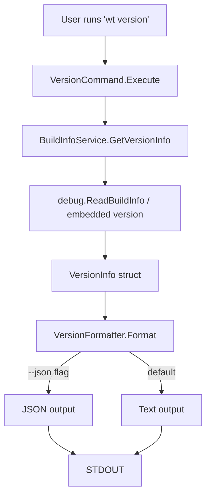

# Data Model: Version Command

**Date**: 2026-02-23
**Feature**: Version Command

## Entities

### VersionInfo

**Purpose**: Represents the version information to be displayed by the version command.

**Fields**:
- `Version` (string): Semantic version number (MAJOR.MINOR.PATCH)
- `BuildDate` (string, optional): Build timestamp
- `GitCommit` (string, optional): Git commit hash
- `GoVersion` (string, optional): Go compiler version
- `Platform` (string, optional): Target platform (linux/amd64, darwin/arm64, etc.)

**Validation Rules**:
- `Version` must follow semantic versioning format (regex: `^v?(0|[1-9]\d*)\.(0|[1-9]\d*)\.(0|[1-9]\d*)(?:-((?:0|[1-9]\d*|\d*[a-zA-Z-][0-9a-zA-Z-]*)(?:\.(?:0|[1-9]\d*|\d*[a-zA-Z-][0-9a-zA-Z-]*))*))?(?:\+([0-9a-zA-Z-]+(?:\.[0-9a-zA-Z-]+)*))?$`)
- Optional fields can be empty strings if information not available

**State Transitions**: N/A (immutable data structure)

**Relationships**: None (self-contained entity)

## Data Flow

## Storage

**No persistent storage required**: Version information is either:
1. Embedded in the binary during build (via ldflags)
2. Extracted from the binary's build info at runtime

## Interface Contracts

### VersionCommand Interface

**Method**: `Execute(outputFormat string) (string, error)`

**Parameters**:
- `outputFormat`: "text" or "json"

**Returns**:
- Formatted version string
- Error if formatting fails

**Contract**:
- Must return valid semantic version in default format
- Must return valid JSON when format="json"
- Must handle missing optional fields gracefully

### BuildInfoService Interface

**Method**: `GetVersionInfo() (*VersionInfo, error)`

**Returns**:
- Pointer to VersionInfo struct
- Error if version information cannot be retrieved

**Contract**:
- Must return non-nil VersionInfo with valid Version field
- Optional fields can be empty but not nil
- Must work without network access

## Error Handling

**Error Types**:
- `ErrVersionNotFound`: Version information cannot be retrieved
- `ErrInvalidFormat`: Requested output format is invalid
- `ErrFormatFailed`: Failed to format version information

**Error Contract**:
- All errors must implement `error` interface
- Error messages must be user-friendly
- Exit codes must follow Unix conventions (0=success, 1=error)

## Testing Requirements

### Unit Tests
- Test version string parsing and validation
- Test JSON formatting
- Test text formatting
- Test error conditions

### Integration Tests
- Test CLI command execution
- Test output formats
- Test exit codes
- Test help integration