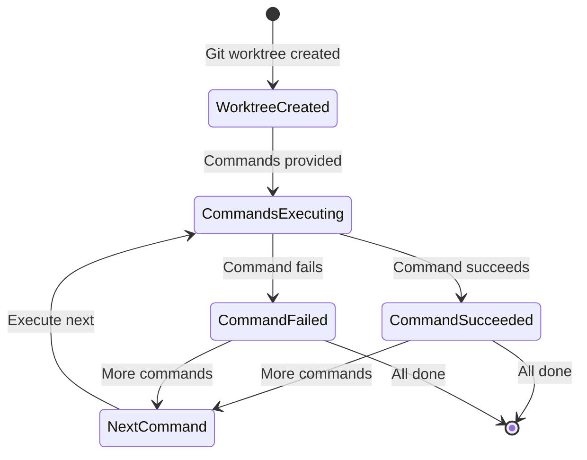
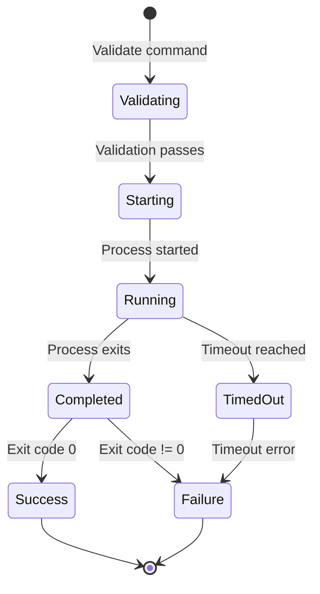

# Data Model: Add --exec Option to Worktree Add Command

## Entities

### Worktree (Extended)
**Purpose**: Represents a Git worktree with optional post-creation commands

**Fields**:
- `Path` (string): Absolute path to the worktree directory
- `Branch` (string): Git branch or commit reference
- `GitDir` (string): Path to the .git directory
- `IsBare` (bool): Whether this is a bare repository
- `Commands` ([]Command): List of commands to execute after creation (NEW)

**Validation Rules**:
- Path must be absolute and within repository boundaries
- Branch must be a valid Git reference
- Commands must not be empty if provided

**Relationships**:
- Has many: Command (one-to-many)

### Command (New)
**Purpose**: Represents a command to execute in a worktree context

**Fields**:
- `Name` (string): Command name/executable
- `Args` ([]string): Command arguments
- `Dir` (string): Working directory (worktree path)
- `Env` ([]string): Environment variables (optional)
- `Timeout` (time.Duration): Execution timeout (default: 5 minutes)
- `Interactive` (bool): Whether command requires user input

**Validation Rules**:
- Name must not be empty
- Name must not contain path traversal characters
- Args can be empty for commands without arguments
- Timeout must be positive

**Relationships**:
- Belongs to: Worktree (many-to-one)

### ExecutionResult (New)
**Purpose**: Represents the result of command execution

**Fields**:
- `Command` (string): The command that was executed
- `Success` (bool): Whether execution succeeded
- `ExitCode` (int): Process exit code
- `Stdout` (string): Standard output
- `Stderr` (string): Standard error
- `Duration` (time.Duration): Execution time
- `Error` (error): Any execution error

**Validation Rules**:
- Command must not be empty
- ExitCode should be >= 0
- Duration should be positive

## State Transitions

### Worktree Creation with Commands


### Command Execution Lifecycle


## Data Flow

### Add Command with --exec
```
User Input → CLI Parser → Worktree Service → Git Worktree Creation → Command Executor → Results
                       ↑                          ↑
                   Validation                 Error Handling
```

### Multiple Command Execution
```
Commands Queue → [Command 1 → Execute → Result] → [Command 2 → Execute → Result] → ...
                     ↑                              ↑
                 Error Handling                Error Handling
```

## Validation Rules

### Command Validation
1. Command name must not be empty
2. Command name must be a valid executable name
3. Command arguments must be properly formatted
4. No path traversal attempts in command or arguments
5. Timeout must be within reasonable bounds (1s to 1h)

### Worktree Validation
1. Worktree path must be valid and accessible
2. Git reference must exist and be valid
3. Worktree must be successfully created before command execution
4. Commands must not interfere with Git operations

## Error Handling

### Command Execution Errors
- `CommandNotFoundError`: Command executable not found
- `PermissionDeniedError`: Insufficient permissions to execute
- `TimeoutError`: Command execution timed out
- `NonZeroExitError`: Command returned non-zero exit code
- `InteractiveWarning`: Command appears to be interactive

### Recovery Strategies
- Continue with next command on failure (unless critical)
- Preserve worktree even if commands fail
- Provide clear error messages with remediation guidance
- Log all execution details for debugging

## Implementation Notes

### Cross-Platform Considerations
- Use `os.PathSeparator` for path handling
- Handle Windows vs Unix command differences
- Use `exec.LookPath` for command resolution
- Set appropriate shell behavior based on platform

### Security Considerations
- Validate all user-provided command input
- Avoid shell interpretation when possible
- Use `exec.Command` instead of `exec.CommandShell`
- Set proper working directory explicitly
- Limit environment variable inheritance

### Performance Considerations
- Minimize overhead between worktree creation and command execution
- Use efficient string handling for command output
- Avoid unnecessary file system operations
- Consider command execution time in overall performance budget